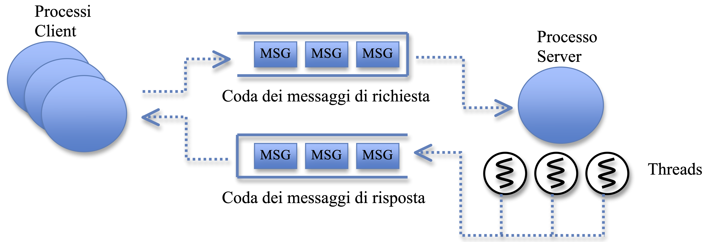

Un primo esempio di server multithread
======================================

Si realizzi in linguaggio C/C++ un processo servente **multithread**
basata su **code di messaggi UNIX**. Il processo servente, denominato
**Server**, attende di ricevere messaggi provenienti da un gruppo di 3
processi denominati **Client**. Ogni client invia 5 richieste di
elaborazione. Ogni messaggio inviato dovrà contenere il PID del Client e
due valori interi, selezionati casualmente tra 0 e 100 con la funzione
`rand()`[^1]. I processi Client devono inoltre attendere e stampare a
video il messaggio di risposta del Server proveniente da un'apposita
coda dei messaggi di risposta, prima di mandare la richiesta successiva.
I processi Client devono essere generati dallo stesso programma
principale attraverso la primitiva `fork()`. Quando tutti i Client
terminano, il processo padre invia un messaggio speciale al Server,
contenenti la coppia di valori {-1, -1}, che causa la terminazione del
Server.

Il Server elabora i messaggi ricevuti come segue: estrae dal messaggio
la coppia di valori e il PID del Client, crea un nuovo thread tramite la
funzione `pthread_create()` a cui passa la coppia di valori e il PID, e
torna a ricevere il messaggio successivo. Ogni thread calcola il
prodotto della coppia di valori in ingresso, ed ha il compito di inviare
al Client (identificato dal PID) un messaggio contenente il valore
calcolato, tramite la coda di messaggi di risposta (da gestire in
**mutua esclusione**); dopodiché il thread termina. Quando il Server
riceve il messaggio con la coppia di valori {-1,-1}, termina.

{width="\\textwidth"}

**Soluzione**

Processo Padre

    creazione della coda dei messaggi di richiesta
    creazione della coda dei messaggi di risposta

    fork di un processo Server

    for(1..3)
        fork di un processo Client

    for(i..3)
        wait

    invia messaggio {-1,-1} sulla coda delle richieste

    wait

[^1]: La generazione casuale può essere implementata con la funzione
    rand() di stdlib.h; ad esempio: int incr = rand() % 101 rand()
    richiede che venga generato un seme dei numeri casuali attraverso la
    funzione srand(time(NULL)).
